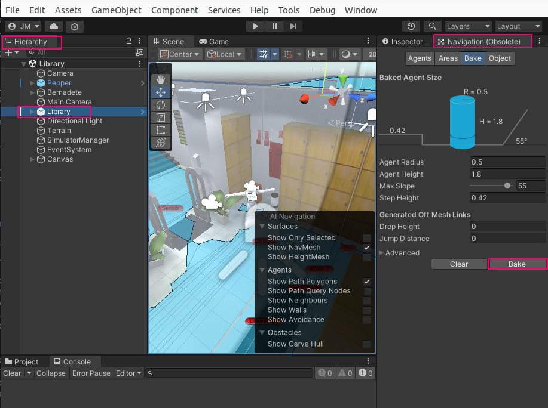
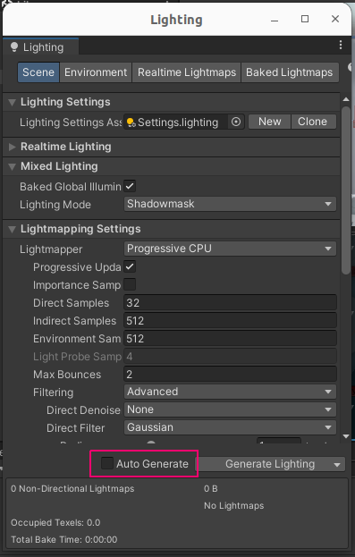

# ss24-reinforcement-learning-simulator update
## SimDRLSR: Deep Reinforcement Learning Simulator for Social Robotics

[![Stars][stars-shield]][stars-url]
[![Issues][issues-shield]][issues-url]
[![License][license-shield]][license-url]

<!--Table of contents-->
<details open="open">
  <summary>Table of Contents</summary>
  <ol>
    <li>
      <a href="#about-the-project">About The Project</a>      
    </li>
    <li>
      <a href="#pre-requisites">Pre-requisites</a>
    </li>
    <li>
    <a href="#installation">Installation</a>
      <ul>
      <li><a href="#unity-configuration">Unity Configuration</a></li>
      <li><a href="#simdrlsr-configuration">SimDRLSR Configuration</a></li>
      <li><a href="#testing-configuration-files">Testing Configuration Files</a></li>
      <li><a href="#how-to-setup-the-conda-environment">How to setup the conda environment</a></li>
      <li><a href="#how-to-run-the-simulator">How to run the simulator</a></li>
      <li><a href="#validate-the-simulator">Validate the simulator</a></li>
      <li><a href="#training-with-pymdqn">Training with pyMDQN</a></li>
      </ul>
    <li><a href="#license">License</a></li>
    <li><a href="#references">References</a></li>
   </ol> 

## About the project
This project is an update of the [SimDRLSR](https://github.com/JPedroRBelo/simDRLSR) (Deep Reinforcement Learning and Social Robotics Simulator) simulator and includes compatibility upgrades and for future improvements the design of an API to improve its existing functions.

The simulation environment enables efficient, safe, and controlled testing and validation of reinforcement learning models. The simulator allows the robot (Pepper) to interact with an avatar (human), performing four main tasks: greeting, following with your gaze, greeting and waiting.

## Pre-requisites
The simulator requirements are:
- Ubuntu 22.04 LTS
- Unity 2022.3.32f1

pyMDQN requirements in the document [requirement](requirements.txt).

- Python 3.12
- Pytorch 2.3.1

Hardware Requirements:
- GPU with 6 GB VRAM

## Installation

1. Cloning repository 
    ```sh
   git clone -b dev --single-branch git@github.com:HBRS-SDP/ss24-reinforcement-learning-simulator.git
   ```

## Unity Configuration 

The following steps are the configuration for generate Unity simulator file (simDRLSR.x86_64)

1. In Unity software, go to `File>Open project>`open project and select the folder "simDRLSR unity". If unity Hub is been used, click on Add and select the same folder. 
2. Go to `File>Open Scene>` and open "Library.unity" located in simDRLSR_Unity/Assets/Scenes/
3. With Library.unity opened, click on Library on Hierarchy.
4. Go to `Window>AI>Navigation(Obsolete)` and click on "Bake"

    

5. Go to `Window>Rendering>Lighting` and verify that "Auto Generate" checkbox is unchecked

    
7. Go to `File>Build Settings>` and click on "Build"
8. Navigate to "ss24-reinforcement-learning-simulator/" folder and save it with the name "simDRLSR.x86_64"

## SimDRLSR Configuration

The `config.xml` file stores the settings for the simulation. The configuration options are:
- **Simulation Quality**:
  - Very Low
  - Low
  - Medium
  - High
  - Very High  
  The default value is "Medium".
- **Frames Per Second (FPS)**: 60
- **Screen Width**: 640
- **Screen Height**: 480
- **Fullscreen**: True or False (default)
<!-- - ‼️ **IP Address**: stores the IP of pyMDQN module. Default is 127.0.0.1. If you are running the pyMDQN on a docker container, you need to set the container's IP.
- ⚠️ **Port**: port that the pyMDQN module uses for socket communication. Default is 12375. -->
- **Path Prob Folder**: folder with human avatar probabilities files.
- ⚠️ **Path WorkDir**: directory with pyMDQN files. Change to `ss24-reinforcement-learning-simulator/pyMDQN`if you need to use pyMDQN.
- ⚠️ **Total Steps**: defines the number of interactions that robot performs at each data collection. Note: set a higher value than set in the pyMDQN.
- ⚠️ To use pyMDQN it is not necessary to use a docker container, however, we encourage the use of Conda to install modules, such as pytorch, pip, numpy, etc.
- The IP address is seted to localhost IP `127.0.0.1`. You can change this in `environment.py` pyMDQN script in the pyMDQN folder.

Labels:
- ‼️ : fundamental importance, needs to be configured;
- ⚠️ : needs to be configured if the pyMDQN parameters are modified;

## Testing Configuration Files

After setting up the simulator and before running a full training session, it's important to validate your configuration files. Follow these steps to run the configuration tests:

1. Ensure you are in the Unity project directory:
   ```sh
   cd ss24-reinforcement-learning-simulator/'simDRLSR Unity'
   ```
2. Open the Unity project and navigate to the Test Runner:
    In Unity, go to Window > General > Test Runner

3. In the Test Runner window, select "Edit Mode" and click "Run All" to execute all configuration tests.

4. Verify that all tests pass. These tests check:
  - Proper loading of probability files
  - Correct JSON format of configuration files
  - Validity of probability distributions
  - Proper initialization of avatar behaviors

By running these tests, you can ensure that your configuration is correct before starting a time-consuming training process.


## How to setup the conda environment

### Adding Conda Channels

Before creating the Conda environment, add the necessary channels:

```sh
conda config --add channels conda-forge
conda config --add channels defaults
```

1. Create a new conda environment with the following command:
```sh
conda create --name simDRLSR --file requirements.txt
```

2. Activate the conda environment:
```sh
conda activate simDRLSR
```

## How to run the simulator
Follow the next steps  to run the simulator:
1. Change to the ss24-reinforcement-learning-simulator directory:
```sh
cd ss24-reinforcement-learning-simulator
```
2. Execute the simulation file:

```sh
./simDRLSR.x86_64
 ```


## Validate the simulator
Follow the next steps  to run the validation script :
1. Open a new terminal
2. Change to the ss24-reinforcement-learning-simulator/pyMDQN directory:
```sh
  cd ss24-reinforcement-learning-simulator/pyMDQN
  ```
3. Execute the validation script using python:
```sh
  python3 API_test.py
  ```


## Training with pyMDQN
 
 1. Run the simulator, as described above: 

  ```sh
  cd ss24-reinforcement-learning-simulator
  ./simDRLSR.x86_64
  ```
2. On a new terminal:
 
  ⚠️ Make sure to back up your trained models before performing the next steps.
  
  ⚠️ Remmember to config. WorkDir of simDRLSR with pyMDQN directory!
 
 - Erasing old train files and images: 
 
   ```sh
   cd ss24-reinforcement-learning-simulator/pyMDQN
   rm -rf dataset/RGB/ep*
   rm -rf dataset/Depth/ep*
   ``` 
 - If you are using Conda environment:
 
   ```sh
   conda activate simDRLSR
   ```
 - Initializing files and models:
 
     ```sh
     python3 makefiles.py
     python3 init_model.py
     ```
 
 - Run the main script:
     ```sh
     python mdqn.py
     ```

## License

Distributed under the MGNU GPL 3.0. See `LICENSE` for more information.
 
 
## References
This simulator is based on the following works:

- [simDRLSR](https://github.com/JPedroRBelo/simDRLSR)
- [pyMDQN](https://github.com/JPedroRBelo/pyMDQN/)

[1] Ahmed Hussain Qureshi, Yutaka Nakamura, Yuichiro Yoshikawa and Hiroshi Ishiguro "Robot gains social intelligence through Multimodal Deep Reinforcement Learning" Proceedings of IEEE-RAS International Conference on Humanoid Robots (Humanoids) pp. 745-751, Cancun, Mexico 2016.

<!-- MARKDOWN LINKS & IMAGES -->
<!-- https://www.markdownguide.org/basic-syntax/#reference-style-links -->
[stars-shield]: https://img.shields.io/github/stars/HBRS-SDP/ss24-reinforcement-learning-simulator.svg?style=for-the-badge
[stars-url]: https://github.com/HBRS-SDP/ss24-reinforcement-learning-simulator/stargazers
[issues-shield]: https://img.shields.io/github/issues/HBRS-SDP/ss24-reinforcement-learning-simulator.svg?style=for-the-badge
[issues-url]: https://github.com/HBRS-SDP/ss24-reinforcement-learning-simulator/issues
[license-shield]: https://img.shields.io/badge/license-GNU%20GPU%203.0-brightgreen?style=for-the-badge
[license-url]: https://github.com/HBRS-SDP/ss24-reinforcement-learning-simulator/blob/60b6762eeeed9ca5d0001aaf9a77c8b1cf242252/LICENSE
